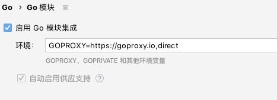

# 简介

---

> [巨量IP](http://www.juliangip.com) - API SDK - Golang

## 开始

### 修改环境变量
```go
GOPROXY=https://goproxy.io,direct
```



在代码块中直接引用即可
```go
    import (
	    juliang "gitee.com/juliangip/juliang-go-sdk/com.juliang"
	    "gitee.com/juliangip/juliang-go-sdk/com.juliang/common"
    )
```

### 通过go get安装
通过`go get`将SDK安装到您的`GOPATH`中：
```go
go get https://gitee.com/juliangip/juliang-go-sdk
```

### 通过源码包安装
前往 [gitee代码托管地址](https://gitee.com/juliangip/juliang-go-sdk) 下载最新代码，解压后将其放在您的GOPATH中

## 示例
在[juliang_test.go](https://gitee.com/juliangip/juliang-go-sdk/blob/master/test/juliang_test.go) 文件中看详细示例
```go
package main

import (
	"fmt"
	juliang "gitee.com/juliangip/juliang-go-sdk/com.juliang"
	"gitee.com/juliangip/juliang-go-sdk/com.juliang/common"
)

func main() {
	dynamicGetIps()
}

func dynamicGetIps() {
	var dynamicGetIps common.DynamicGetIps
	dynamicGetIps.SetKey("0794d170bd34223546345fdgs24502bb21cbcd")
	dynamicGetIps.SetTrade_no("113551087435342335679")
	dynamicGetIps.SetNum("10")
	value := juliang.DynamicGetIps(dynamicGetIps)
	fmt.Println(value)
}
```


## 参考资料
* [API文档](https://www.juliangip.com/help/api/api/)

